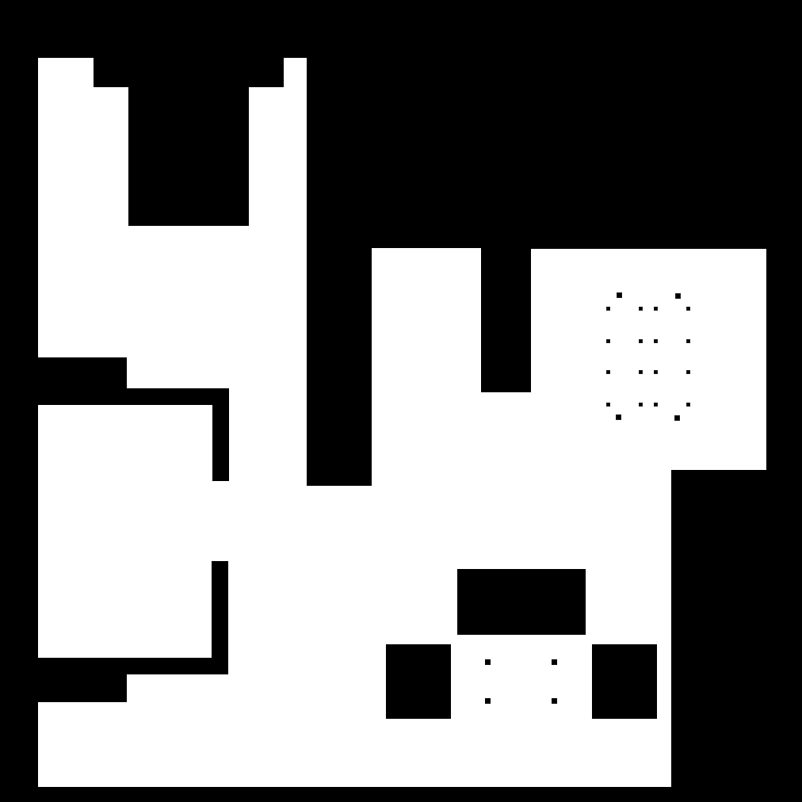
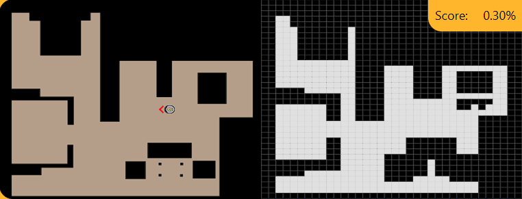

# 🧹 Práctica 1: Localized Vacuum Cleaner
{: .fs-9 }

Programa una aspiradora robótica de gama alta para que limpie una casa de manera eficiente.
{: .fs-6 .fw-300 }

[Ver enunciado en JdeRobot](https://jderobot.github.io/RoboticsAcademy/exercises/MobileRobots/vacuum_cleaner_loc){: .btn .btn-purple .mr-2 }
[Volver al Índice](../README.md){: .btn }

---

## Descripción del ejercicio

En esta primera práctica abordamos el problema de la localización y la planificación de trayectorias de cobertura con BSA para un robot aspirador. Es una aspiradora es de gama alta, que cuenta con un algoritmo de autolocalización robusto que mantiene una estimación buena de posición y orientación del robot.
Para lograr una cobertura lo más completa posible del entorno he decidido seguir los siguientes pasos:
---

## 🧠 0. Razonar cómo lo vamos a resolver (Nivel Deliberativo)

Para conseguir esta funcionalidad en este robot de servicio hay que resolver tres tareas de forma coordinada: 
1. **Registro del mapa** de la casa.
2. **Planificación del movimiento** usando el algoritmo BSA visto en clase. 
3. **Ejecución de la ruta de navegación** con un controlador reactivo que corrija las posibles desviaciones en el movimiento debidas al ruido en los actuadores.

## 🗺️ 1. Registro del mapa con mallado (Nivel Intermedio)

El primer paso consiste en modelar el entorno utilizando una aproximación basada en cuadrículas o grid map. 
* Realizamos una aumentación de los obstáculos para dotar al robot de un margen de seguridad antichoque y generamos una cuadrícula de celdillas de navegación.
* Durante la ejecución, el mapa clasifica el espacio en tres categorías: **obstáculos reales**, **obstáculos virtuales** (zonas libres que el robot ya ha visitado) y **celdas libres**.

 

## 🌀 2. Planificación del camino a seguir con BSA (Nivel Intermedio)

Para garantizar que el robot barra todo el espacio disponible, utilizamos el algoritmo **BSA (Backtracking Spiral Algorithm)**: este algoritmo se basa en la ejecución de caminos en espiral combinados con un mecanismo de retroceso para asegurar la cobertura total.
* El robot evalúa a sus 4 vecinos y avanza hacia una dirección hasta encontrar un obstáculo; en ese momento gira en 2 sentidos (90º) trazando una espiral.
* A medida que avanza, el algoritmo va marcando las zonas ya visitadas como obstáculos virtuales y actualiza constantemente los puntos de retorno (backtracking points) en las celdas adyacentes no visitadas.
* Cuando el robot llega a un punto crítico donde está rodeado completamente de obstáculos reales o virtuales, ejecuta un **mecanismo de retroceso**: este algoritmo calcula la ruta hacia el punto de retorno libre más cercano para reanudar el recorrido sistemático completo.

## ⚙️ 3. Ejecución de la ruta (Nivel Reactivo)

La ejecución física de la ruta recae sobre un controlador o navegador local encargado de guiar a la base motriz, corrigiendo las desviaciones por ruido. 
Además, para mejorar la efectividad y no dejar bordes sin limpiar, el algoritmo BSA utiliza comportamientos reactivos: si el robot detecta un obstáculo real que no había visitado durante la espiral, suspende temporalmente el BSA para iniciar un procedimiento de seguimiento de pared. Esto le permite rodear el obstáculo y limpiar las celdillas parcialmente ocupadas antes de regresar a su ruta principal en espiral.

---

## 📸 Resultados y Demostración

A continuación se muestra la visualización de la solución en el simulador de Unibotics, donde se aprecia la cuadrícula generada y las celdas cubiertas por la aspiradora:

### 🎥 Vídeo Solución
*(Vídeo solución)*
